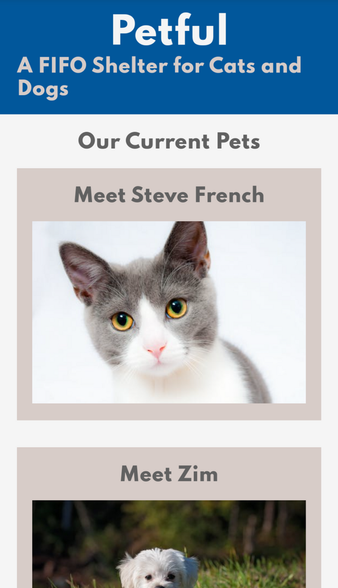
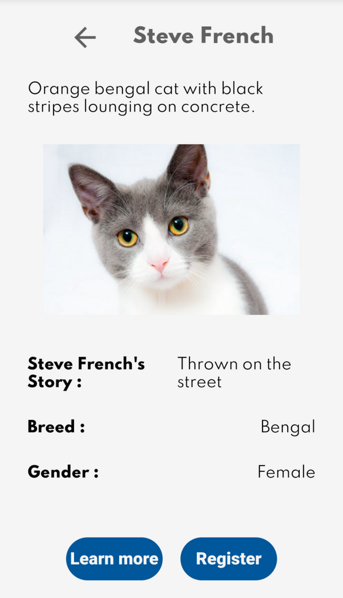
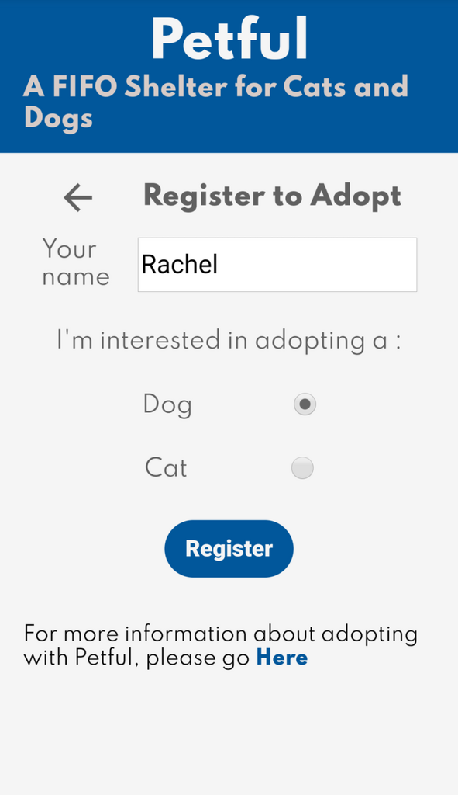

# Petful

Petful is an app for a shelter that only can hold one dog and one cat at a time. Users to add their name to a queue for pet adoption. When the pet is available, the user can choose if they want to keep it.

This is a repository of the Petful client.

View the live app [Here](https://petful-client-template-eight.vercel.app/)

Check out the server repository [Here](https://github.com/Rachanastasia/petful-server)

## Tech Stack

- React
- HTML5
- CSS3
- Deployed with Vercel

## Images

## User Stories (from Thinkful assignment)

### User Story #1

As a pet lover, I want to visit the FIFO pet adoption site
so that I can get more information about the adoption process.

### User Story #2

As a user interested in adopting pets, I want to get more information
on each pet so that I can make an informed decision about who to adopt.

### User Story #3

As a user interested in adopting pets,
I want to see the pets that I can adopt.

### User Story #4

As a user interested in adopting pets, I want to get in line to adopt.

### User Story #5

As a user interested in adopting pets, I want to adopt a pet.

## Available Scripts

In the project directory, you can run:

### `npm start`

Runs the app in the development mode.
Open [http://localhost:3000](http://localhost:3000) to view it in the browser.

The page will reload if you make edits.
You will also see any lint errors in the console.
